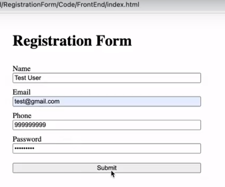
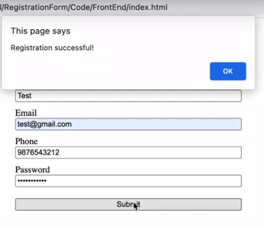
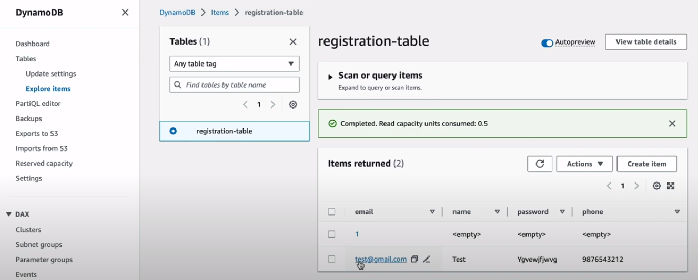

# AWS Serverless Registration Application 

# Project Description:
#   Deploy And configure dynamoDB table
#   Create iam role
#   Lambda function
#   Setupt Api Gateway EndPoint
#   Enable CORS for cross domain request

Build a serverless web application using AWS Lambda, DynamoDB, and . Api Gateway
The application will allow users to create, read, update, and delete (CRUD) items from a DynamoDB table.

# Project Architecture:


### Steps to Build the Project:

* Create a DynamoDB table to store the items. \
* Build a Lambda function to handle the CRUD operations on the DynamoDB table. \
* Use S3 to store and host the web application's static files (HTML, CSS, and JavaScript). \
* Create a CloudFront distribution to serve the S3-hosted static files with low latency. \

-   Step 1: Create dynamoDB table 
    -   create table
        -   name => registration-form
        -   partition key => email
        -   create table

-   Step 2 : Create Iam role to lambda fun to allow access dynamoDB table
-   Iam 
    -   Roles
        -   crate Role
            -   type => aws service
            -   use case => Lambda
            -   next and search => AmazonDynamoDBFullAccess   and Cloud WatchFullAccess
            -   role name => RegistrationFormRole
            -   Create Role

-   Step 3 : Create Lambda Function
    -   aws lambda
        -   create function
            -   Author From Scrash
            -   name => Registration-form-function
            -   Python3.9
            -   use an existing role => RegistrationFormRole
            -   Create Function
            - code

            ```bash
            import json
            import boto3

            dynamodb = boto3.resource('dynamodb')
            table = dynamodb.Table('registration-table')

            def lambda_handler(event, context):
                # Get request body
                print(event)

                # Create new item in DynamoDB table
                response = table.put_item(
                    Item={
                        'email': event['email'],
                        'name': event['name'],
                        'phone': event['phone'],
                        'password': event['password']
                    }
                )

                # Return response
                return {
                    'statusCode': 200,
                    'headers': {
                        'Content-Type': 'application/json',
                        'Access-Control-Allow-Origin': '*'
                    },
                    'body': json.dumps({'message': 'Registration successful'})
                }
            ```

        -   Deploy

-   Step 3: 
            -   DynamoDB
            -   click registration table
            -   create item
            -   create attribute
                -   email
                -   name
                -   phone
                -   password
-   Step 4: create API Gateway
    -   amazon api gateway
        -   select Rest api 
            -   build
            -   New Api
                -   name
                -   create api
            -   action and create new resouce
                -   resource name => register   
                - enable api gateway CORS
                - create resource
            - action and create method
                -   Select POST
                    -   integration type => lambda function
                    -   lambda function => registration-form-function
                    -   Save
            -   action and enable CORS
                -   enable cors and replace existing cors header
            
            -   action and deploy api 
                -   deploy stage=> new stage
                    -   stage name => prod
                    -   stage description => prod
                    -   deploy
                -   copy url and past in java script code 

-   

-   

-   